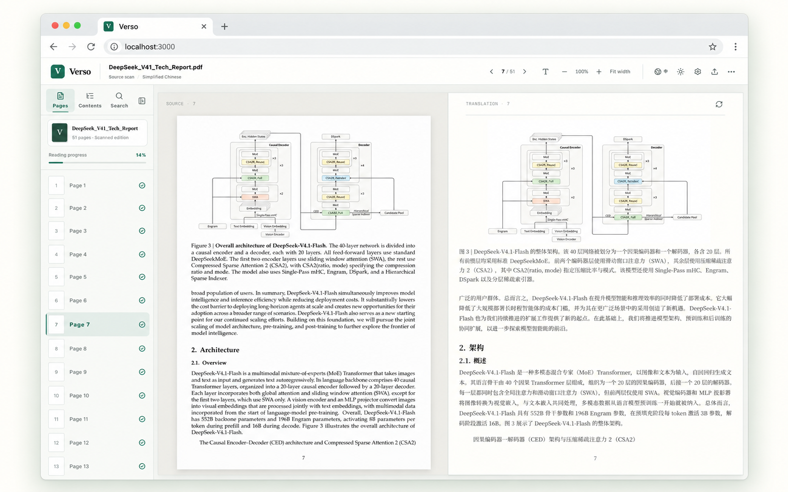
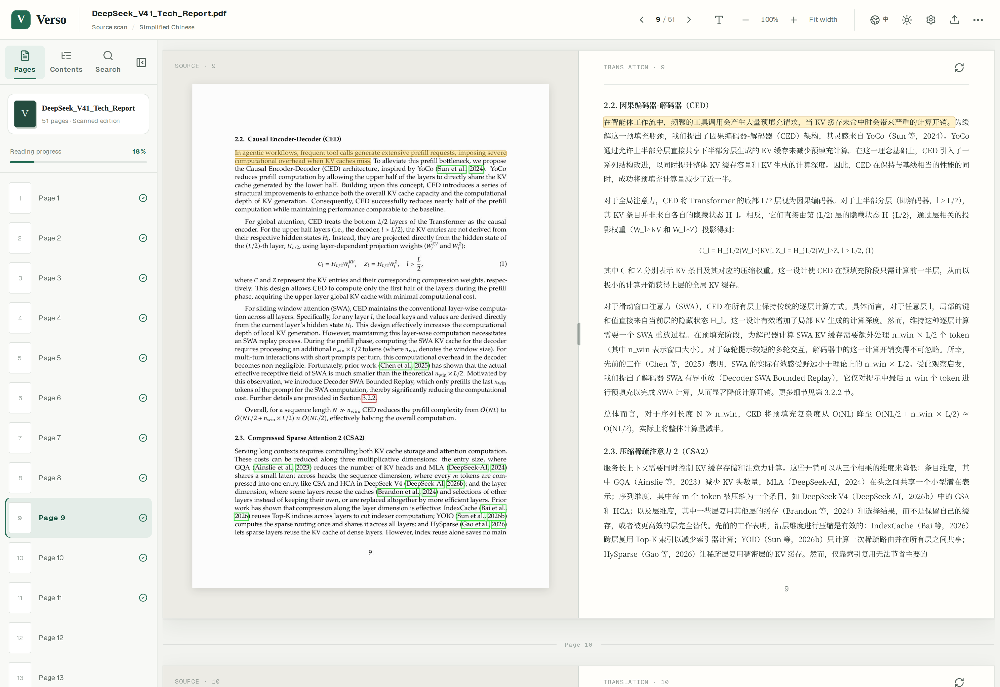
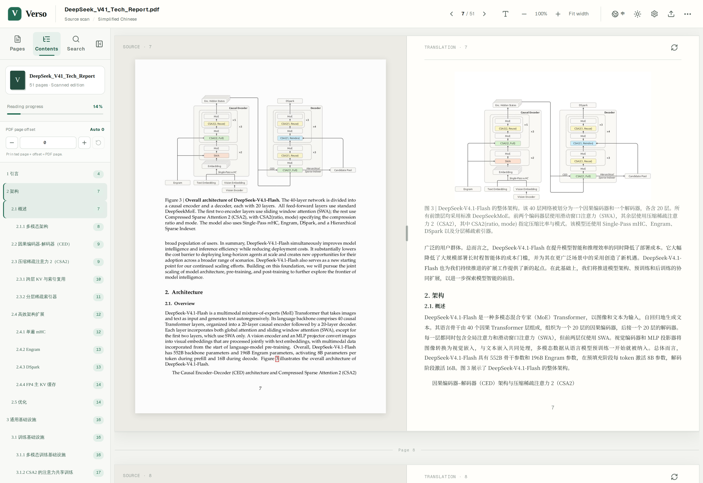
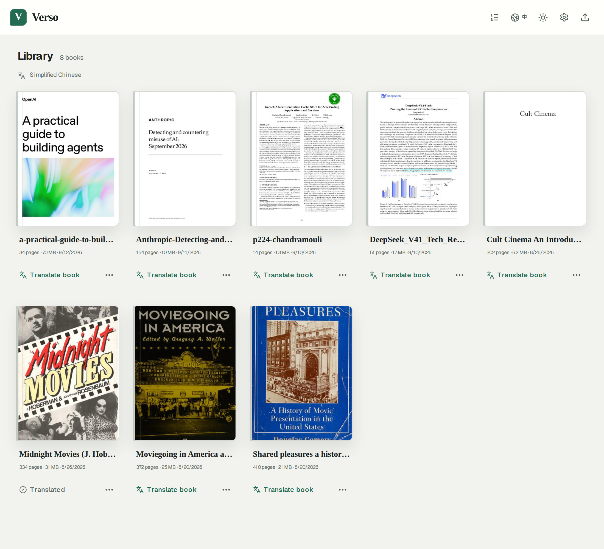
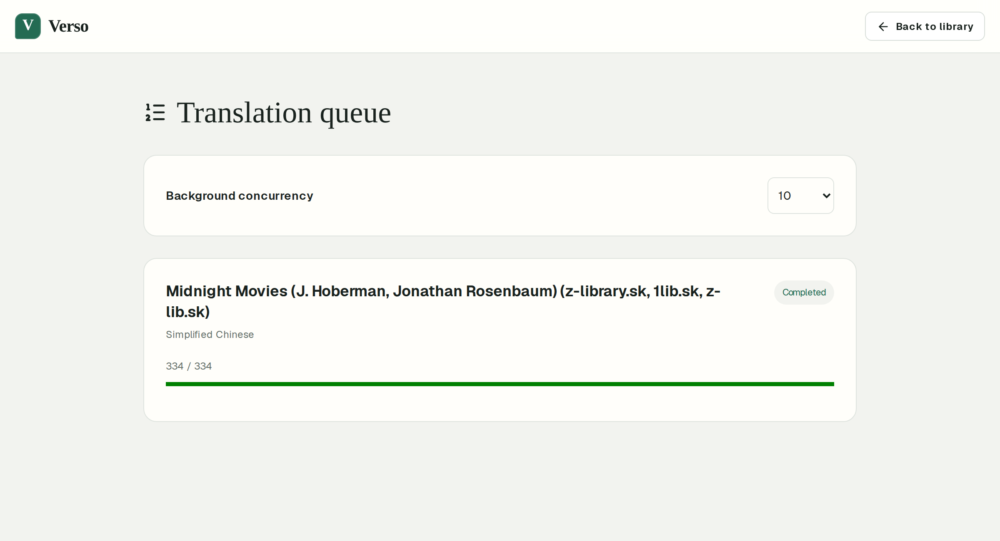
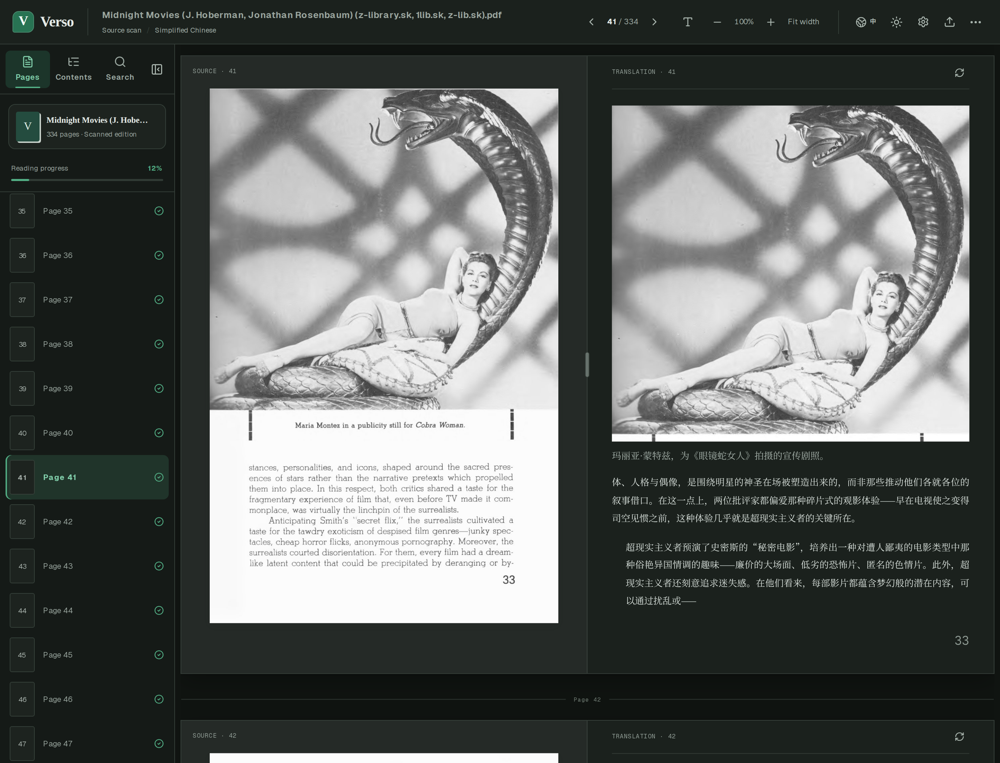
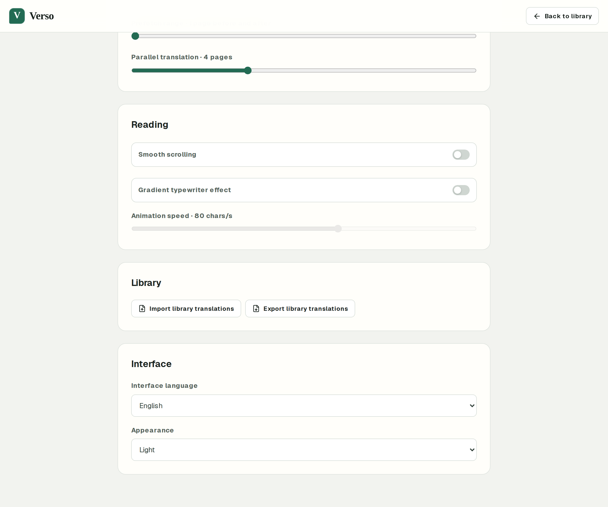
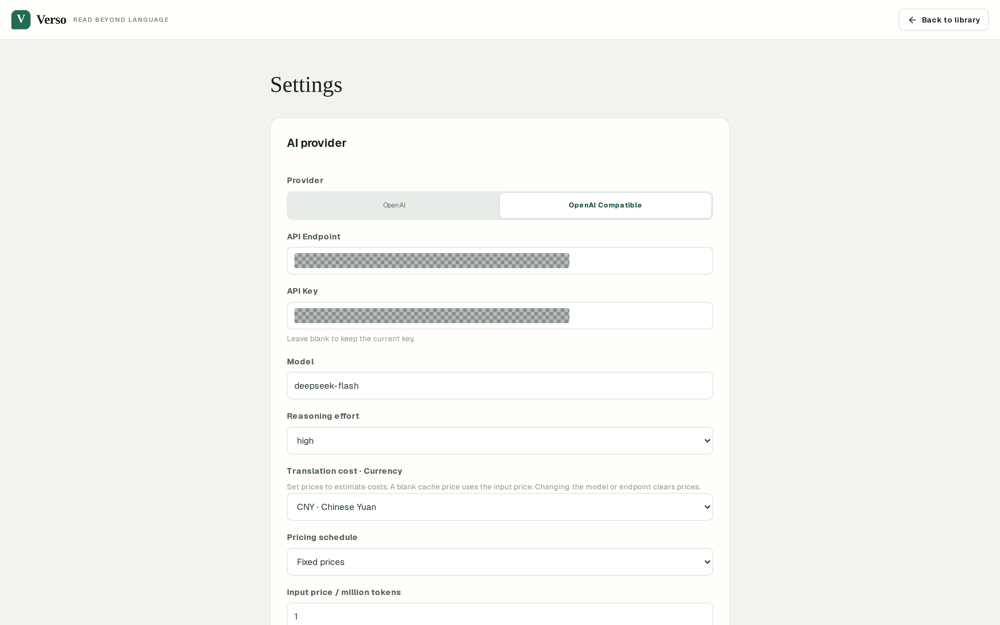
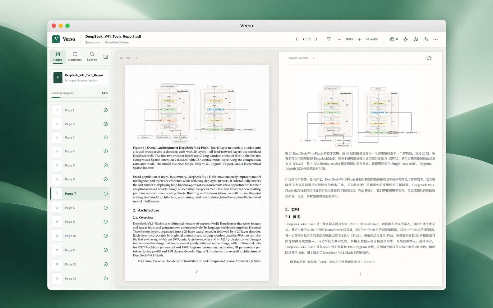

# Verso

**Read beyond language.**

A bilingual PDF reader for **macOS** and your **self-hosted browser**. Read
scanned books and technical papers with the original page beside an AI
translation, keeping illustrations, structure, and source context in view.

[Get started](#get-started) · [Features](#features) · [Development](#development) · [Documentation](#documentation)



*Browser presentation mockup built from an [actual Verso screenshot](docs/images/reader-deepseek-en.png).*

## Features

- **Read in parallel.** Keep the source scan and translation side by side. Follow
  a sentence back to its original lines with hover or keyboard focus.
- **Keep the page's structure.** Preserve headings, paragraphs, lists, captions,
  figures, and page numbers. Render text tables, copyable code blocks, and
  KaTeX formulas when they can be extracted reliably.
- **Smart contents navigation.** Automatically build a clickable chapter list
  from translated contents pages and match printed page numbers to PDF pages.
- **Find your place.** Browse page thumbnails and search saved translations
  with **Cmd/Ctrl + F**.
- **Translate a whole book.** Queue books in the background with bounded
  concurrency, automatic retries, and stop/resume controls. Reading takes
  priority over pending background work.
- **Make reading comfortable.** Choose light or dark mode, adjust translation
  fonts, and zoom the whole spread. Set English or Chinese UI independently
  of the translation language.
- **Keep your library.** Store PDFs, page indexes, and translations on your own
  filesystem. Export and import translation backups for one book or the library.
- **Choose your AI provider.** Connect the OpenAI Responses API or an
  OpenAI-compatible provider. Inspect token usage, estimated costs, and
  translation timings when available.

### Check a sentence against the source

Hover over a translated sentence to highlight the matching words on the scan.
Verso uses PDF word positions or local OCR for image-only pages. A bounded
window of adjacent pages provides context and helps resolve split paragraphs.



### Smart contents navigation

Turn a book's printed table of contents into clickable chapter navigation.
After a contents page is translated, Verso automatically extracts its entries
and hierarchy into the **Contents** sidebar. Detected printed page numbers
calibrate the offset to PDF pages, helping chapter links account for covers
and front matter. Adjust the offset manually when needed, or reset it to
automatic calibration.



### A library that stays with you

Upload PDFs, reopen saved translations, and queue longer books for later.
Rendering is lazy and translation concurrency is bounded, so a large scanned
book does not need to be rendered or translated all at once.



### Background translation

Work continues while the browser is closed, as long as the server is running.
Saved jobs resume after a restart. Completed pages are reused, and retries
focus on unfinished pages. Background and reader concurrency are configured
separately.



See the [translation guide](docs/translation-guide.md#background-translation-queue)
for retry limits, cancellation, and recovery.

### Dark mode and reading preferences

The interface and translated page adapt to dark mode while the source scan
keeps its original appearance. Adjust the translation font, fit the spread to
width, or zoom with the toolbar and keyboard shortcuts.





### Provider settings and translation costs

Configure your endpoint, API key, model, reasoning effort, and optional token
prices in Settings. Provider credentials stay in the local backend; the
settings API returns only a masked key hint. Prices you enter are used for
estimates when compatible usage data is available.



## Get started

### macOS app

Run Verso as a standalone desktop app with its own local library. Node.js,
Poppler, Tesseract, and OCR language data are bundled; end users do not need
Docker, Homebrew, or a separate Verso server.



*Illustrative macOS window mockup using the same reader; not a captured Mac session.*

1. Open a successful main-branch run of [CI](https://github.com/MrCroxx/Verso/actions/workflows/ci.yml?query=branch%3Amain).
2. Download **Verso-macOS-arm64** for Apple Silicon or **Verso-macOS-x64** for Intel.
3. Extract the artifact, open the DMG, and drag **Verso.app** into Applications.
4. Open Verso, configure an AI provider in **Settings**, and upload a PDF.

CI installers are ad-hoc signed and not notarized. See the
[desktop guide](docs/desktop.md) for installation, signing, and building your
own installer. These builds are distributed as CI artifacts, not GitHub Releases.

The desktop library lives in `~/Library/Application Support/Verso/library`.
Closing the window keeps background work running; quitting the app or system
sleep stops or pauses processing. Saved queue progress resumes on launch.

### Browser app with Docker

```bash
docker run -d \
  --name verso \
  --restart unless-stopped \
  -p 3000:3000 \
  -v verso-data:/data \
  ghcr.io/mrcroxx/verso:latest
```

Open [localhost:3000](http://localhost:3000), configure your provider in
**Settings**, and upload a PDF. Images are available for `linux/amd64` and
`linux/arm64`.

From a checkout of this repository, you can also use the included
[Compose configuration](compose.yaml):

```bash
docker compose up -d
```

To update a Compose deployment:

```bash
docker compose pull
docker compose up -d
```

The named volume stores the library and SQLite database. Preserve it when
updating or replacing the container. For access outside a trusted network,
place authentication and TLS in front of the web app.

### Your data and your provider

Books, rendered pages, indexes, and saved translations stay in the Docker
volume or desktop application-support directory. The two installations have
separate libraries. Translation requests send the required page content and
context to your configured AI provider; local storage does not make AI
translation offline. Saved translations can be read without another provider
request.

Back up the complete data directory to preserve PDFs and configuration. For
portable translation-only backups, use **Settings → Library** or a book's
reading menu. These exports exclude PDFs, credentials, and queue jobs; import
them after adding the matching PDFs. See the [backup guide](docs/translation-guide.md#translation-backups).

## Development

Requires **Node.js 22.13+**, npm, and local PDF/OCR tools. On Debian or Ubuntu:

```bash
sudo apt-get install poppler-utils tesseract-ocr \
  tesseract-ocr-chi-sim tesseract-ocr-chi-tra tesseract-ocr-jpn
npm ci
npm run dev
```

The development server binds to `0.0.0.0:3000` for LAN access. Configure AI
credentials in Settings; they are not read from environment variables.

For a local production server:

```bash
npm run build
npm start
```

Data defaults to `.data`. Set `VERSO_DATA_DIR` to choose another directory.
The stack is React, Next.js, TypeScript, SQLite, Poppler, Tesseract, and Electron
for the desktop app.

Before contributing:

```bash
npm run lint
npm test
```

`npm test` builds the production app and runs the application test suite.
See [AGENTS.md](AGENTS.md) for repository conventions.

## Documentation

- [Translation guide](docs/translation-guide.md) — providers, cost estimates, backups, and background jobs.
- [Desktop development and packaging](docs/desktop.md) — native tooling, installation, signing, and validation.
- [Translation traces](docs/translation-traces.md) — timings, streaming counters, timeouts, and diagnostic exports.
- [Performance investigation](docs/translation-performance.md) — measurements and implementation tradeoffs.
- [Showcase image sources](docs/images/showcase-prompts.md) — screenshot provenance and promotional-image prompts.
