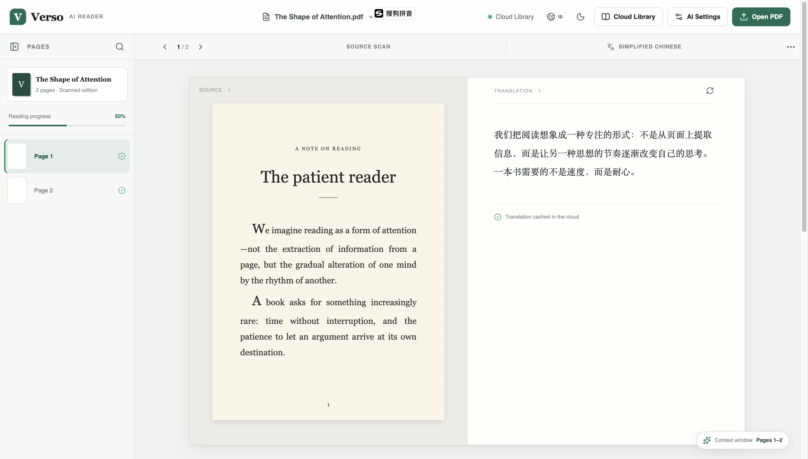
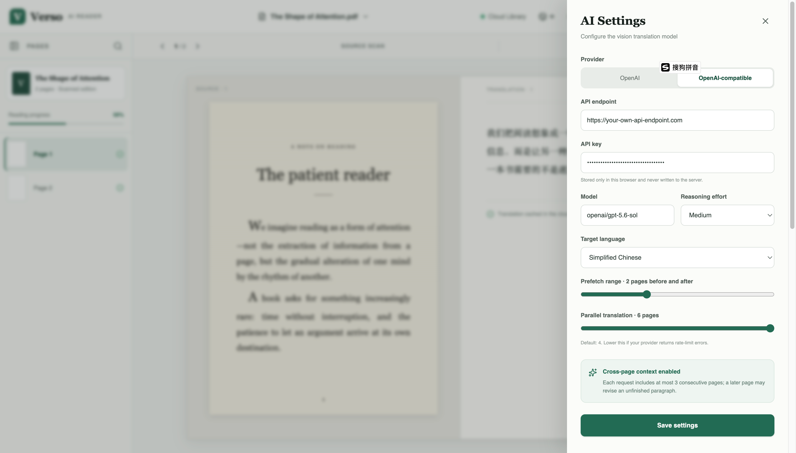
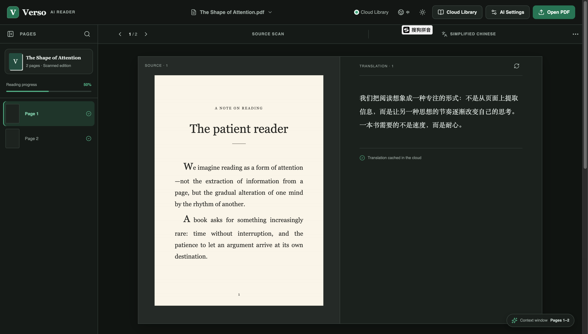

# Verso

Verso is an AI-powered web reader for scanned PDF books. It keeps the original
page visible beside a layout-aware translation, so you can read across
languages without losing the typography, illustrations, or structure of the
source.



## Features

- **Side-by-side reading:** compare the source scan and translation while
  navigating pages from a persistent sidebar with reading progress.
- **Layout-aware vision translation:** preserve headings, paragraphs, lists,
  captions, whitespace, and page numbers instead of flattening each page into
  plain text.
- **Cross-page context:** translate with a bounded window of consecutive pages,
  revise unfinished paragraphs, and deterministically remove duplicated text at
  page boundaries.
- **Flexible AI providers:** use the OpenAI Responses API or an
  OpenAI-compatible endpoint, with configurable model, reasoning effort, target
  language, prefetch range, and translation concurrency.
- **Cloud library and caching:** keep uploaded PDFs, page indexes, blank-page
  results, and translations in cloud-backed storage so books remain available
  across reading sessions.
- **Automatic contents navigation:** detect translated contents pages, preserve
  printed page references, and calibrate PDF page offsets automatically or
  manually.
- **Translation search:** search cloud-cached translations, jump directly to a
  result, and highlight matches without scanning or retranslating the book.
- **Large-book performance:** lazily render pages and bound background
  translation work to keep scanned books with hundreds of pages responsive.
- **Reader preferences:** switch the interface between English and Simplified
  Chinese independently of the translation target, choose a light or dark
  theme, and configure animated page navigation without altering the source
  scan.

## Screenshots

### Translation configuration

Open Settings to configure a hosted OpenAI model or any compatible endpoint,
then tune the context window, prefetch behavior, and parallelism for the
provider's limits. API credentials are persisted only in the browser and are
never written to the application server's storage.



### Dark theme

The reader chrome and translated page adapt to dark mode while the scanned page
retains its original appearance.



## Technology

- React 19 and the Next.js App Router API through vinext.
- PDF.js for browser-side scanned page rendering.
- Cloudflare D1 for metadata and translation records.
- Cloudflare R2 for uploaded PDF objects.
- TypeScript, Tailwind CSS, and Lucide icons.

## Requirements

- Node.js 22.13 or newer.
- npm.

## Local Development

```bash
npm ci
npm run dev
```

The development server listens on `0.0.0.0:3000`. Open
`http://localhost:3000` locally or use the machine hostname from another device
on the same network.

Provider credentials are configured in the application. Translation results,
uploaded books, and page indexes are not stored in browser caches.

## Validation

```bash
npm run lint
npm test
```

`npm test` creates a production build and runs the rendering, translation
normalization, blank-page caching, cross-page deduplication, and concurrency
tests.

## Repository Conventions

Repository-wide contribution and language rules are documented in
[`AGENTS.md`](./AGENTS.md).
